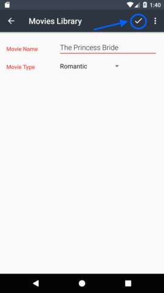

# MoviesLibrary2 #
MoviesLibrary2 is an Android application that allows users to create a movie watch list. Users can easily add, edit and delete movies from their watch list.

#### 1) Opening the application ####
Once the application is installed select the MoviesLibrary2 from your application list.   

#### 2) Adding a movie to your watch list ####
To add a movie to your watch list click the add icon.  
  

Type in the name of the movie and select a category from the list.  
  

Select the checkmark to save the movie to your list.  
  

After you have added the movie you will be returned to the home screen(your movie list).  
  
=======
=======

#### 2) Adding a movie to your watch list ####
To add a movie to your watch list click the add icon.  
  

Type in the name of the movie and select a category from the list.  
  

Select the checkmark to save the movie to your list.  
  

After you have added the movie you will be returned to the home screen(your movie list).  

#### 3) Editing and deleting movies ####
You can view, edit or delete a movie by selecting it from the list.  
To edit the movie simply change the details and select the save checkmark once more.  

To delete a movie select delete from the menu located in the upper right corner of the application.
  
=======
  
>>>>>>> upstream/master
=======
  

